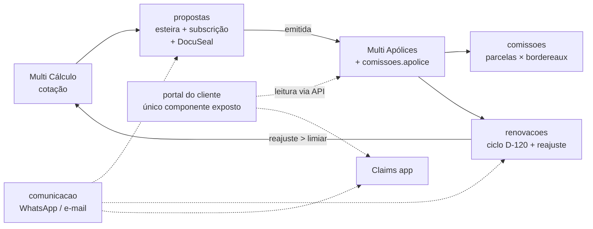

# Arquitetura do sistema Hamsa IPMI — visão geral dos módulos

Este documento amarra os módulos do sistema da corretora: os **6 apps já em
produção** no NAS `hamsa-usa` (ver `DEPLOY.md`) e os **módulos novos**
especificados neste repo, cada um com sua pasta (`README.md` de desenho +
`schema.sql` validado).

## Princípio: monólito modular sobre um Postgres único

Um único PostgreSQL 16 no NAS (container `hamsa-comissoes-db`, criado pela
fase 0 de Comissões — `nas/comissoes-fase0.sh`) é o **banco unificado da
corretora**. Cada módulo vive num **schema próprio** e referencia os dados
dos outros por FK entre schemas — sem cópia, sem sincronização interna.

A UI segue a decisão já tomada no deploy dos PWAs (Android: 1 app por
hostname): o **Command Center é o hub**; cada módulo novo entra como item da
sidebar, não como PWA separado.

## Mapa dos módulos

| Módulo | Pasta | Schema | Estado | Depende de |
|--------|-------|--------|--------|------------|
| Comissões | [`comissoes/`](comissoes/) | `comissoes` | ✅ especificado + fase 0 pronta (PR #6) | — |
| Cadastro (banco unificado de pessoas) | [`cadastro/`](cadastro/) | `cadastro` | especificado | `comissoes` |
| Propostas & Subscrição | [`propostas/`](propostas/) | `propostas` | especificado | `cadastro`, `comissoes`, DocuSeal |
| Renovações 2.0 (reajuste) | [`renovacoes/`](renovacoes/) | `renovacoes` | especificado | `comissoes`, `comunicacao` |
| Comunicação (WhatsApp/e-mail) | [`comunicacao/`](comunicacao/) | `comunicacao` | especificado | `cadastro` |
| Portal do Cliente | [`portal/`](portal/) | `portal` | especificado (última fase) | todos acima |

Fora do banco unificado, há também a integração **Agente WhatsApp ×
Multicálculo** (cotação automática pelo WhatsApp com aprovação humana):
desenho em [`agente-wa/`](agente-wa/).

**Ordem de aplicação dos schemas** (respeita as FKs):
`comissoes` → `cadastro` → `comunicacao` → `propostas` → `renovacoes` → `portal`.
Todos os `schema.sql` são idempotentes; aplicar tudo de novo nunca quebra.

## Entidades compartilhadas — quem é dono do quê

- **`comissoes.seguradora`, `comissoes.produto`, `comissoes.apolice`** já
  nasceram no primeiro módulo e são **promovidas a entidades compartilhadas**:
  todos os módulos as referenciam por FK. O módulo Cadastro adiciona
  `cliente_id` à apólice (via `ALTER ... ADD COLUMN IF NOT EXISTS`),
  substituindo gradualmente o `titular_nome` texto-livre.
- **`cadastro.pessoa` / `cadastro.cliente`** são o registro-mestre de gente:
  titulares, dependentes, pagadores, contatos. Nenhum outro módulo cadastra
  pessoa — todos apontam para cá.
- Se um dia incomodar "seguradora morar no schema comissoes", a consolidação
  num schema `core` é um rename barato — decisão adiada de propósito.

## Fluxo ponta a ponta do cliente

Os apps existentes (Multi Cálculo, Multi Apólices, Claims, Sales Pipeline,
Renovações v1, Command Center) continuam como estão; os módulos novos se
integram por **import/sync** primeiro (fase de cada módulo) e por FK direta
quando cada app migrar seu armazenamento para o banco unificado.

## Decisões transversais (valem para todos os módulos)

1. **LGPD / dado sensível**: respostas de declaração de saúde e detalhes
   clínicos de sinistro **não entram estruturados no banco** — guarda-se o
   documento assinado (referência + hash) e flags de status. Detalhe no
   módulo Propostas.
2. **Exposição externa**: nada da tailnet vira público. O único componente
   desenhado para a internet é o Portal do Cliente, isolado e somente-leitura
   via API interna (threat model no `portal/README.md`).
3. **Credenciais** (DocuSeal, Twilio/Meta, SMTP): nunca no banco nem no repo —
   variáveis de ambiente do container; o banco guarda só o *nome* da variável.
4. **Moeda**: valor na moeda de origem é imutável; conversão via
   `comissoes.taxa_cambio` (PTAX) só para reporting. Regra herdada de
   Comissões para todos.
5. **Convenções de schema**: nomes em pt-BR, `bigint IDENTITY`, enums como
   `text + CHECK`, `timestamptz`, DDL idempotente, views prontas para os
   cards do Command Center.
6. **Backup**: `pg_dump` diário (já instalado pela fase 0) cobre todos os
   schemas automaticamente — módulo novo não precisa de backup próprio.

## Roadmap consolidado

A ordem otimiza valor por esforço e respeita dependências:

1. **Fase 0 Comissões** (pronta) — Postgres no ar.
2. **Comissões fases 1–4** — taxas reais, sync de apólices, importador de
   bordereau, KPIs no hub. *Dinheiro direto no caixa.*
3. **Cadastro** — pessoas/clientes unificados + `cliente_id` nas apólices.
   *Fundação para todo o resto; sem isso os módulos seguintes degradam.*
4. **Comunicação** — templates + fila + consentimento. Entra cedo porque
   Renovações e Propostas disparam por ela.
5. **Propostas & Subscrição** — fecha o buraco entre Multi Cálculo e Multi
   Apólices; ativa o DocuSeal que já está instalado no NAS.
6. **Renovações 2.0** — ciclos D-120, reajuste calculado, cadência automática,
   gatilho de re-cotação. *Retenção.*
7. **Portal do Cliente** — por último, quando os dados internos estiverem
   consistentes; é vitrine, não fundação.
