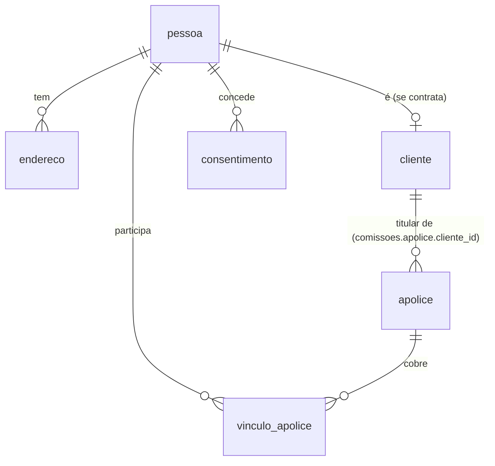

# Módulo de Cadastro — banco unificado de pessoas (Hamsa IPMI)

O registro-mestre de **gente**: titulares, dependentes, pagadores e contatos,
compartilhado por todos os módulos. Resolve o problema clássico de cada app
ter sua própria cópia de "cliente" — hoje o CRM, o Multi Apólices e o
Renovações não concordam entre si sobre quem é quem.

Artefatos: `README.md` (este desenho) + `schema.sql` (schema `cadastro`,
validado em Postgres 16). **Aplicar depois de `comissoes/schema.sql`** — este
módulo altera `comissoes.apolice` (adiciona `cliente_id`).

## 1. O que este módulo é — e o que não é

**É**: a única tabela de pessoas da corretora, com identidade resolvida
(documento normalizado), vínculos pessoa↔apólice com papel e período, e o
registro central de **consentimento LGPD** que o módulo de Comunicação
consulta antes de qualquer disparo.

**Não é**: CRM de funil (isso é o Sales Pipeline) nem cadastro de produto/
seguradora (isso vive em `comissoes`, promovido a entidade compartilhada —
ver `ARQUITETURA.md`).

## 2. Modelo de dados

- **`pessoa`** — física ou jurídica. Peculiaridade IPMI: o cliente pode ser
  estrangeiro, então documento é `(doc_tipo, doc_numero)` com tipos `cpf`,
  `cnpj`, `passaporte`, `outro` — não um campo "CPF" obrigatório. Documento
  normalizado (coluna gerada, só alfanumérico maiúsculo) com **unicidade por
  tipo+número**; e-mail com índice por `lower(email)`. Nacionalidade e país
  de residência (ISO-3166 alpha-2) porque elegibilidade e tributação de IPMI
  dependem disso.
- **`cliente`** — o subconjunto de pessoas que contrata: status
  (`prospect/ativo/inativo`), origem (indicação, campanha…), corretor
  responsável. `pessoa_id UNIQUE`: uma pessoa é no máximo um cliente.
- **`vinculo_apolice`** — quem participa de cada apólice e como: papel
  (`titular/dependente/pagador`), parentesco, datas de inclusão/exclusão
  (dependente que sai no meio da vigência é encerrado, nunca apagado —
  histórico é auditável).
- **`endereco`** — 1:N com tipo (`residencial/comercial/cobranca`) e flag
  `principal` (índice único parcial garante no máximo 1 principal por pessoa).
- **`consentimento`** — LGPD: finalidade (`marketing/operacional`), canal
  (`whatsapp/email/telefone`), concedido/revogado com timestamps. Regra de
  consumo (implementada no módulo Comunicação): *marketing exige opt-in
  vigente; operacional é permitido por execução de contrato, salvo revogação
  explícita*.
- **Evolução de `comissoes.apolice`** — o schema adiciona `cliente_id`
  (FK para `cadastro.cliente`). O `titular_nome` texto-livre continua
  existindo durante a transição; a view `v_apolices_sem_cliente` lista o que
  falta vincular.

## 3. Identidade: como evitar cadastro duplicado

1. **Na entrada**: busca obrigatória por documento normalizado e por
   `lower(email)` antes de criar pessoa (a UI do hub força isso; o banco
   garante unicidade de documento).
2. **No legado**: a fase de migração importa dos apps existentes
   (Sales Pipeline e Multi Apólices) e usa a view `v_possiveis_duplicatas`
   (mesmo e-mail ou mesmo nome+nascimento com ids diferentes) como fila de
   revisão humana — merge é decisão de gente, não de script.
3. **Merge**: manter o registro mais antigo, repontar FKs (`vinculo_apolice`,
   `consentimento`, `comissoes.apolice.cliente_id`), marcar o perdedor como
   `mesclada_em` (soft delete auditável). Função `mesclar_pessoas()` no schema.

## 4. Integração com os apps existentes

| App | Direção | Como |
|-----|---------|------|
| Multi Apólices | import inicial + sync | export CSV/endpoint JSON → job liga `comissoes.apolice.cliente_id`; enquanto isso a view de pendências mede o progresso |
| Sales Pipeline (CRM) | import inicial | prospects viram `pessoa`+`cliente` status `prospect` |
| Claims / Renovações | leitura | passam a resolver pessoa por aqui quando migrarem para o banco unificado |
| Comunicação | leitura | consulta `consentimento` a cada disparo |

## 5. LGPD

- Dados aqui são cadastrais (não sensíveis), mas ainda assim pessoais:
  acesso autenticado por usuário no hub, nunca só "estar na tailnet".
- **Direito de eliminação**: `pessoa.anonimizada_em` + função
  `anonimizar_pessoa()` — apaga nome/documento/contatos e mantém o esqueleto
  referencial (apólices e comissões são registro legal/financeiro e ficam,
  sem identificação direta).
- Consentimento nunca é apagado nem editado — revogação é um novo estado com
  timestamp (trilha de auditoria da própria LGPD).

## 6. Views para o Command Center

- `v_clientes` — clientes com nº de apólices ativas, prêmio anual somado por
  moeda e último vínculo;
- `v_apolices_sem_cliente` — progresso da migração (meta: zero);
- `v_possiveis_duplicatas` — fila de revisão de identidade;
- `v_aniversariantes_mes` — relacionamento (nascimento, não vigência).

## 7. Roadmap do módulo

| Fase | Entrega | Critério de pronto |
|------|---------|--------------------|
| 1 | Schema aplicado + telas de pessoa/cliente no hub | criar/buscar/editar pessoa pelo hub |
| 2 | Import do Multi Apólices + vinculação `cliente_id` | `v_apolices_sem_cliente` = 0 |
| 3 | Import do Sales Pipeline (prospects) + dedup | `v_possiveis_duplicatas` triada |
| 4 | Registro de consentimento na entrada + no portal | 100% dos disparos de Comunicação com base de consentimento |
