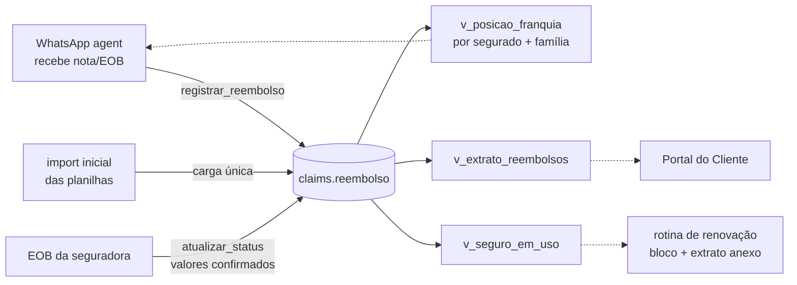

# Módulo de Claims / Reembolsos — controle de sinistro e franquia (Hamsa IPMI)

A fonte **automatizada e única** da posição de reembolsos e franquia de cada
apólice. Substitui o controle em Excel (`claims 20XX … .xlsx`) e o trabalho
manual: uma vez que o dado vive aqui, os **três** consumidores leem da mesma
tabela — a rotina de renovação (bloco "Seu seguro em uso" + extrato anexo), o
WhatsApp agent (cliente perguntando "quanto já bati da franquia?") e o Portal
do Cliente (status do reembolso).

Artefatos: `README.md` (este desenho) + `schema.sql` (schema `claims`,
validado em Postgres 16). **Aplicar depois de `comissoes` e `cadastro`.**

## 1. Por que este módulo existe

O extrato de reembolsos que a renovação já gera hoje (por apólice, por segurado,
com acúmulo de franquia no ano-apólice) é montado na hora a partir de planilha.
Enquanto o dado for planilha, nada mais consegue consultá-lo sem duplicar
lógica. Este módulo promove esse extrato a **dado estruturado no banco
unificado**: cada solicitação de reembolso vira uma linha, e as posições
(franquia por pessoa, franquia da família, extrato, "seguro em uso") viram
**views** que qualquer módulo lê.

## 2. Conceito central: a solicitação de reembolso

Cada linha do extrato é uma `reembolso`, presa a uma **apólice** e a um
**segurado** (o titular ou um dependente — a franquia acumula por pessoa). Ela
carrega os três valores que estruturam tudo:

- **apresentado** — a despesa que o cliente apresentou;
- **franquia** — a parte que ficou por conta do segurado e **conta para o
  acúmulo da franquia anual** (0 em benefícios isentos: check-up/maternidade);
- **reembolsado** — o que a seguradora pagou a favor do cliente.

A diferença `apresentado − franquia − reembolsado` é o **não coberto** (coluna
gerada), com o motivo na própria linha (ex.: `S26 — serviços não cobertos`).

O ciclo de status segue o do Portal: `recebido → em_processamento → processado`
(ou `negado`). O valor oficial vem do **EOB** da seguradora; até o EOB, a linha
fica `em_processamento` e os valores são estimativa.

## 3. O ano-apólice (a janela da franquia)

A franquia **zera a cada aniversário da apólice**, não no ano-calendário. A
função `ano_apolice(apolice_id, data)` devolve o início do ano-apólice de uma
data de serviço (mesma técnica de aniversário por `age()` usada em Renovações),
e é por essa janela que as views agrupam o acúmulo. O teto da franquia e se ela
é **individual ou familiar** ficam em `plano_franquia` (por apólice e ano) — daí
sai o "quanto falta".

## 4. Modelo de dados (resumo — DDL em `schema.sql`)

- **`reembolso`** — uma linha por solicitação: `apolice_id`, `segurado_pessoa_id`
  (+ `segurado_nome` texto-livre enquanto a migração de Cadastro não fecha),
  `data_servico`, `prestador`, `moeda`, `apresentado`, `franquia`,
  `reembolsado`, `nao_coberto` (gerado), valores na moeda de origem
  (`apresentado_orig`/`moeda_orig`), `isenta` (check-up/maternidade),
  `beneficio` (categoria **não clínica**), `status`, `motivo_nao_cobertura`,
  `documento_ref` (arquivo em `_CLAIMS` na rede) e `eob_ref`.
- **`plano_franquia`** — teto da franquia por apólice e ano-apólice:
  `franquia_anual`, `moeda`, `tipo` (`individual` | `familiar`). É o que permite
  responder "faltam US$ X".

**LGPD (decisão transversal #1):** nada de conteúdo clínico estruturado. O
módulo guarda valores, prestador, categoria não clínica e **referências** ao
documento/EOB (caminho/hash) — o laudo/diagnóstico permanece no arquivo, nunca
em coluna.

## 5. Entrada dos dados (as três origens)

| Origem | Como entra | Papel |
|--------|-----------|-------|
| `import` | carga única das planilhas atuais → linhas históricas | aposenta o Excel sem perder histórico |
| `whatsapp` | o agent recebe nota/pedido, chama `registrar_reembolso` como `recebido` | fim do lançamento manual |
| EOB | `atualizar_status` grava valores confirmados e move para `processado` | a seguradora é a fonte do valor final |

`registrar_reembolso()` cria a linha (idempotente por `origem`+`origem_id`);
`atualizar_status()` concilia com o EOB. Nenhuma escrita direta na tabela pela
UI — sempre pelas funções, para manter a auditoria e as regras.

## 6. Views para os consumidores

- **`v_extrato_reembolsos`** — o extrato linha a linha (o PDF de hoje), com
  apólice, seguradora, segurado e a janela do ano-apólice.
- **`v_posicao_franquia`** — por apólice **e por segurado** no ano-apólice
  corrente: franquia acumulada, apresentado, reembolsado, não coberto, nº de
  solicitações e nº pendentes; com o teto de `plano_franquia`, o **quanto
  falta**.
- **`v_posicao_franquia_familia`** — o mesmo agregado por **família** (a
  apólice inteira), para franquia familiar.
- **`v_seguro_em_uso`** — os totais do ano-apólice (nº de solicitações,
  apresentado, reembolsado, não coberto, franquia acumulada) — exatamente o
  bloco "Seu seguro em uso" do e-mail de renovação.

## 7. Como cada consumidor usa

- **Rotina de renovação** — lê `v_seguro_em_uso` (bloco do e-mail) e
  `v_extrato_reembolsos` (anexo). Deixa de montar a partir de planilha.
- **WhatsApp agent** — ao cliente confirmado, consulta `v_posicao_franquia`
  (+ familiar) e `v_extrato_reembolsos` e responde "quanto já bateu da
  franquia", "o que está pendente", "o que já processou". Sempre com a ressalva
  de que o valor final é o do EOB da seguradora.
- **Portal do Cliente** — expõe só o **status** (recebido → em análise → pago)
  via as views `portal.v_*` já previstas, sem tocar em detalhe clínico.

## 8. Roadmap do módulo

| Fase | Entrega | Critério de pronto |
|------|---------|--------------------|
| 1 | Schema + `registrar_reembolso`/`atualizar_status` + views | uma apólice consultável por view, batendo com o extrato atual |
| 2 | Import único das planilhas `_CLAIMS` para linhas históricas | `v_seguro_em_uso` reproduz o e-mail de renovação de um cliente real |
| 3 | WhatsApp agent lê `v_posicao_franquia` | cliente pergunta a franquia no WhatsApp e recebe a posição |
| 4 | Rotina de renovação lê as views (fim do Excel) | draft de renovação gerado sem abrir planilha |
| 5 | Ingestão de EOB pelo agent (`atualizar_status`) | reembolso conciliado sozinho ao chegar o EOB |
