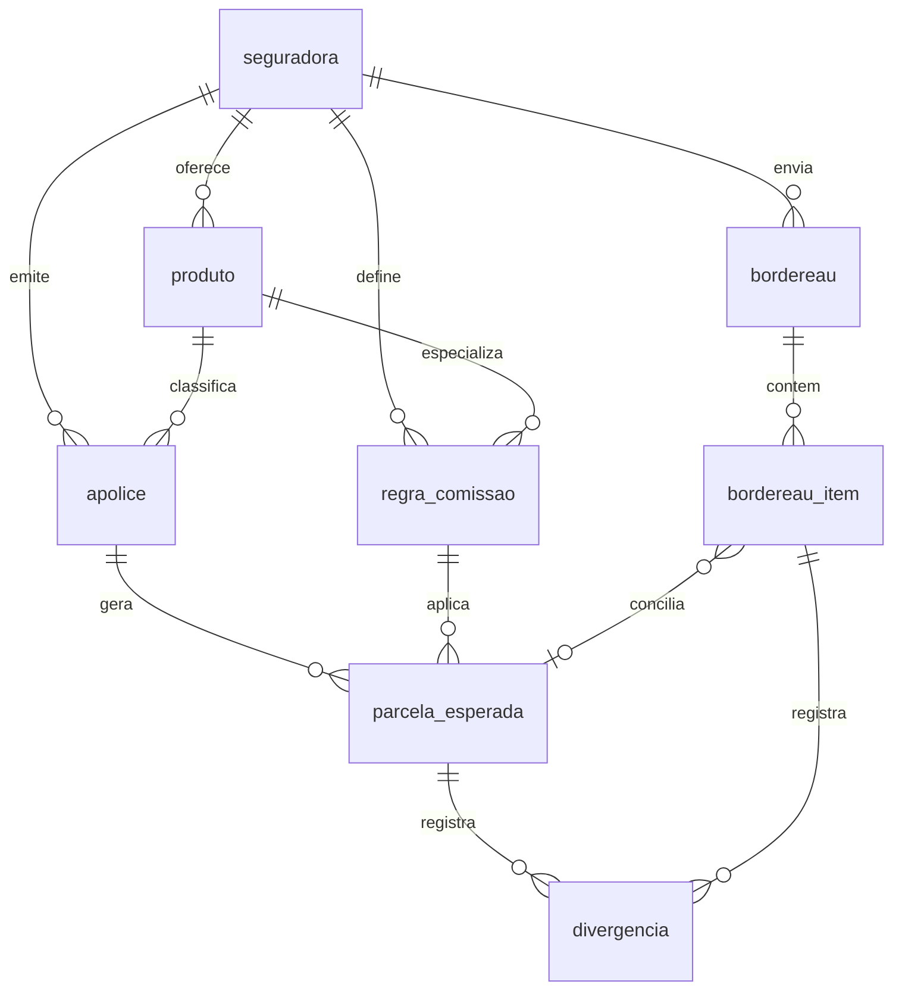

# Módulo de Comissões — especificação (Hamsa IPMI)

Desenho do módulo de **comissionamento e conciliação de bordereaux** para a
corretora, cobrindo a pergunta que nenhum dos 6 apps atuais responde:

> **"Quanto deveríamos ter recebido este mês, de cada seguradora, e quem está
> devendo o quê?"**

Artefatos desta pasta:

| Arquivo      | O que é |
|--------------|---------|
| `README.md`  | Este documento: modelo de dados, fluxo operacional, regras de matching, integração com os apps existentes e roadmap. |
| `schema.sql` | DDL PostgreSQL completo (schema `comissoes`), com views de aging/receita e seeds das seguradoras — pronto para rodar num container Postgres 16 no `hamsa-usa`. |

## 1. O problema, em termos de IPMI

Uma corretora IPMI recebe comissão de várias seguradoras internacionais
(Cigna Global, Bupa Global, Allianz Care, GeoBlue, IMG, April, VUMI…), e cada
uma tem:

- **Taxas diferentes para 1º ano e renovação** (ex.: 20% ano 1, 10% recorrente);
- **Moedas diferentes** (USD, EUR, GBP) — e o caixa da corretora é em BRL;
- **Cadências diferentes** (bordereau mensal, trimestral, "quando der");
- **Formatos de extrato diferentes** (XLSX/CSV, cada um com suas colunas);
- **Clawback**: estorno de comissão quando a apólice cancela nos primeiros
  meses — aparece como linha *negativa* num bordereau futuro.

Sem sistema, a conferência é manual e o que a seguradora deixa de pagar
silenciosamente (taxa errada, apólice esquecida, reajuste não repassado)
simplesmente some. O módulo existe para tornar cada centavo **esperado**
explícito e cobrável.

## 2. Conceito central: esperado × recebido

O módulo mantém duas linhas do tempo e as concilia:

1. **Esperado** — para cada apólice ativa, o sistema gera as
   `parcelas_esperadas` da vigência (prêmio da parcela × taxa da regra de
   comissão vigente). Isso é recalculável e auditável.
2. **Recebido** — cada extrato de comissão da seguradora é importado como um
   `bordereau` com seus `bordereau_itens` (linha a linha, guardando também o
   dado bruto).
3. **Conciliação** — matching automático item ↔ parcela; o que não casar ou
   casar com diferença vira `divergencia` com motivo e fila de tratamento.

## 3. Modelo de dados (resumo — DDL completo em `schema.sql`)

- **`seguradora`** — cadastro da pagadora: moeda padrão, cadência do bordereau
  e **`mapeamento_bordereau` (jsonb)**: o template de importação daquela
  seguradora (qual coluna do XLSX é nº de apólice, prêmio, comissão…). Assim,
  suportar uma seguradora nova = cadastrar um mapeamento, sem código novo.
- **`produto`** — linha de produto por seguradora (IPMI individual, grupo,
  travel…), porque a taxa muda por produto.
- **`regra_comissao`** — taxa de **ano 1** e taxa de **renovação**, base de
  cálculo (prêmio líquido/bruto), com **vigência** (`daterange` + constraint de
  exclusão: impossível cadastrar duas regras sobrepostas para a mesma
  seguradora/produto). Mudou a taxa? Fecha a regra antiga e abre outra — o
  histórico fica íntegro e as parcelas antigas continuam apontando para a
  regra que as gerou.
- **`apolice`** — espelho local mínimo da apólice (nº, titular, prêmio anual,
  moeda, frequência de pagamento, início de vigência, status), com
  `origem`/`origem_id` apontando para o registro no **Multi Apólices**. Tem
  coluna gerada `numero_norm` (maiúsculas, só alfanumérico) para matching.
- **`parcela_esperada`** — uma linha por competência: prêmio esperado da
  parcela, regra aplicada, taxa aplicada (congelada no momento da geração),
  comissão esperada e `ano_vigencia` (1 = primeiro ano → taxa cheia).
  Status: `prevista → conciliada | parcial | divergente | cancelada | clawback`.
- **`bordereau`** / **`bordereau_item`** — o extrato importado. Cada item
  guarda `dados_brutos` (jsonb com a linha original) + campos normalizados +
  `tipo` (`comissao`, `clawback`, `ajuste`, `bonus`) + resultado do matching.
  `arquivo_hash` único impede importar o mesmo arquivo duas vezes.
- **`divergencia`** — a fila de trabalho: esperado × recebido, diferença,
  motivo (`cambio`, `taxa`, `reajuste_nao_registrado`, `clawback`,
  `apolice_desconhecida`, `desconhecido`) e campo de resolução.
- **`taxa_cambio`** — cotações por data (fonte PTAX/BCB ou manual), para
  reporting consolidado em BRL sem nunca sobrescrever o valor na moeda de
  origem.

**Views prontas** (para os cards do Command Center):

- `v_receita_mensal` — esperado × recebido por mês/seguradora/moeda;
- `v_aging` — parcelas vencidas e não pagas em buckets 0–30/31–60/61–90/90+,
  **por seguradora** (a lista de cobrança);
- `v_pendencias_matching` — itens de bordereau sem match e divergências
  abertas.

## 4. Ciclo operacional mensal

1. **Geração (automática, job diário)** — para toda apólice ativa, garante que
   as parcelas esperadas da vigência corrente existam (função
   `comissoes.gerar_parcelas(apolice_id)` no schema). Apólice renovou no Multi
   Apólices → novo ano de vigência → novas parcelas com taxa de renovação.
2. **Importação** — chegou o extrato da seguradora: upload do XLSX/CSV, o
   sistema aplica o `mapeamento_bordereau` daquela seguradora e cria os itens.
3. **Matching automático**, nesta ordem:
   1. `numero_apolice_norm` igual **e** competência compatível → match;
   2. tolerância de valor: diferença ≤ **1%** ou ≤ **1 unidade da moeda**
      (arredondamento/câmbio interno da seguradora) → `conciliada`;
   3. diferença acima da tolerância → `divergente` + registro em `divergencia`;
   4. sem apólice correspondente → fallback por **nome do segurado + valor
      aproximado** (sugestão para confirmação humana, nunca match automático);
   5. valor negativo → `clawback`: casa com parcelas já pagas da apólice e
      marca a apólice para verificação de cancelamento no Multi Apólices.
4. **Tratamento de pendências** — tela única com `v_pendencias_matching`:
   confirmar sugestões, corrigir cadastro, ou gerar cobrança à seguradora.
5. **Fechamento do mês** — bordereau `fechado`; relatório: recebido no mês,
   pendente por seguradora (aging), divergências recuperadas.

## 5. Multi-moeda

Regra de ouro: **o valor na moeda de origem é imutável**; conversão é sempre
derivada (valor, data, taxa, fonte). Consolidação em BRL usa `taxa_cambio` da
data do bordereau (PTAX de fechamento). Nunca gravar "o valor em reais" como
se fosse o dado primário — é assim que conciliação vira ruído.

## 6. Integração com o que já existe

- **UI no hub**: pela limitação já documentada do Android (1 PWA por
  hostname — ver `DEPLOY.md`), Comissões entra como **item na sidebar do
  Command Center**, seguindo o padrão dos outros 5 apps: container próprio no
  NAS (sugestão: porta interna `7000`) + `tailscale serve --bg --https=10004`.
- **Fonte de apólices**: fase 1 — importação/sincronização a partir do
  **Multi Apólices** (export CSV ou endpoint JSON simples no server dele,
  consumido por um job de sync que preenche `apolice` com `origem_id`).
  Fase 2 — quando o Postgres unificado existir, `apolice` vira tabela
  compartilhada e o espelho some.
- **Stack sugerida**: **FastAPI + PostgreSQL 16**, ambos como containers
  Docker no `hamsa-usa` (mesmo padrão operacional dos apps atuais: backup
  `.bak` datado, validar antes de reiniciar, 1 falha → parar). O Postgres novo
  já nasce como o futuro banco unificado da corretora — este módulo é o
  primeiro inquilino, no schema `comissoes`.
- **Backup**: `pg_dump` diário do banco para pasta coberta pelo Hyper Backup.
  Comissões é registro financeiro — perder isso é perder a cobrança.

## 7. KPIs para o card no Command Center

- Comissão **esperada × recebida** no mês (por moeda e consolidada em BRL);
- **Aging** de comissões a receber por seguradora (0–30/31–60/61–90/90+);
- **Divergências abertas** (quantidade e valor);
- **Recuperado no ano**: soma das divergências resolvidas a favor da corretora
  — o número que justifica o módulo;
- Projeção 12 meses (parcelas futuras já geradas × status das renovações).

## 8. LGPD

O módulo guarda o mínimo de dado pessoal (nome do titular e nº de apólice —
nada de dados de saúde). Ainda assim: acesso autenticado por usuário (não
apenas "estar na tailnet"), log de importações com autor (`importado_por`) e
backup criptografado.

## 9. Roadmap de implantação

| Fase | Entrega | Critério de pronto |
|------|---------|--------------------|
| 0 | Postgres 16 no NAS + `schema.sql` aplicado + seeds das seguradoras — **script pronto: [`nas/comissoes-fase0.sh`](../nas/comissoes-fase0.sh)** | `\dt comissoes.*` lista as 9 tabelas; views respondem |
| 1 | Cadastro de regras de comissão reais + sync inicial de apólices do Multi Apólices | 100% das apólices ativas com parcelas esperadas geradas |
| 2 | Importador de bordereau (upload + mapeamento por seguradora) + matching automático | 1 bordereau real de cada seguradora importado e conciliado |
| 3 | Tela de pendências/divergências + relatório de aging | Fechamento de um mês completo dentro do sistema |
| 4 | Card de KPIs no Command Center + entrada na sidebar | Números do card batem com o relatório de fechamento |

A fase 0 está pronta para executar: copiar `nas/comissoes-fase0.sh` para o
`/tmp` do NAS e rodar `sudo sh /tmp/comissoes-fase0.sh`. O script é
autocontido (schema embutido), idempotente e no padrão dos scripts anteriores:
verifica cada etapa e **para na primeira falha**. Ele sobe o container
`hamsa-comissoes-db` (postgres:16, porta `127.0.0.1:5432`, restart automático),
aplica e confere o schema, e instala o `backup.sh` diário (falta só agendar no
Agendador de Tarefas do DSM).
