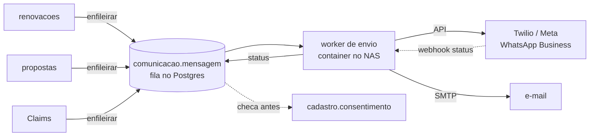

# Módulo de Comunicação — WhatsApp e e-mail (Hamsa IPMI)

A camada única de disparo de mensagens da corretora: **templates + fila +
consentimento LGPD + log**. Renovações, Propostas, Claims e (futuramente) o
Portal não falam com Twilio/Meta/SMTP diretamente — todos enfileiram aqui.

Artefatos: `README.md` (este desenho) + `schema.sql` (schema `comunicacao`,
validado em Postgres 16). **Aplicar depois de `cadastro/schema.sql`** (o
consentimento mora lá).

## 1. Por que um módulo central (e não cada app disparando)

1. **LGPD num lugar só**: a regra de consentimento é aplicada na fila, não
   confiada a cada app. Mensagem sem base legal nem chega ao provedor — nasce
   com status `bloqueada_sem_consentimento` e aparece em relatório.
2. **Auditoria**: todo contato com cliente fica em `mensagem` com contexto
   (qual módulo pediu, referente a quê), status do provedor e timestamps.
3. **Troca de provedor barata**: os apps conhecem `enfileirar()`; Twilio vs.
   API oficial da Meta vs. SMTP é detalhe do worker.

## 2. Arquitetura

- **Fila no próprio Postgres** (`status='na_fila'`, worker com
  `FOR UPDATE SKIP LOCKED`). Volume de corretora não justifica um broker;
  simplicidade > throughput aqui.
- **Worker**: container pequeno no NAS que consome a fila, chama o provedor
  e grava o retorno. Reinício não perde nada — a fila é durável por
  construção.
- **WhatsApp**: via **API oficial** (Meta WhatsApp Business, direto ou via
  Twilio). Mensagens ativas fora da janela de 24h exigem **template aprovado
  pela Meta** — por isso `template.whatsapp_template_name`. Nada de gateway
  não-oficial: risco de banimento do número da corretora.

## 3. Modelo de dados (resumo — DDL em `schema.sql`)

- **`template`** — código estável (ex.: `renovacao_d30`), canal, idioma,
  finalidade (`operacional`/`marketing`), corpo com placeholders
  `{{variavel}}`, nome do template aprovado na Meta (quando WhatsApp) e
  versão. Editar corpo = nova versão; a mensagem enviada referencia a versão
  usada (auditoria do que o cliente efetivamente recebeu).
- **`mensagem`** — a fila e o histórico: pessoa, template+versão, corpo já
  renderizado, contexto `jsonb` (`{"modulo":"renovacoes","ref":"ciclo:123"}`),
  status (`na_fila → enviada → entregue → lida | falha | bloqueada_sem_consentimento`),
  id da mensagem no provedor, `agendada_para` (cadência D-30 agenda para o
  futuro), tentativas e último erro.
- **`mensagem_recebida`** — inbound (fase 2): respostas de WhatsApp via
  webhook, associadas à pessoa pelo telefone E.164; alimenta a "janela de
  24h" e vira notificação no hub.
- **`provedor`** — configuração por canal; credenciais **não** ficam no
  banco: a coluna guarda o *nome da variável de ambiente* do worker.

## 4. A regra de consentimento (o coração do módulo)

Implementada em `enfileirar(pessoa, template, contexto, quando)`:

| Finalidade do template | Regra |
|------------------------|-------|
| `operacional` (renovação, sinistro, cobrança de documento) | Permitido por execução de contrato/legítimo interesse, **salvo revogação explícita** registrada em `cadastro.consentimento` para aquele canal |
| `marketing` (campanha, cross-sell, aniversário) | Exige **opt-in vigente** (concedido e não revogado) para aquele canal |

Sem base legal → a mensagem é criada com `bloqueada_sem_consentimento` (fica
no log, não no provedor). O opt-out chega por: portal, resposta "SAIR" no
WhatsApp (inbound), ou registro manual no hub — todos gravam revogação em
`cadastro.consentimento`, valendo imediatamente para tudo.

## 5. Cadências e agendamento

Quem define *quando* mandar é o módulo de origem (ex.: Renovações agenda
D-90/D-60/D-30 via `agendada_para`). O worker só envia mensagens com
`agendada_para <= now()`. Cancelamento de cadência (cliente renovou antes) =
módulo de origem marca as futuras como `cancelada` pelo contexto.

## 6. Views para o Command Center

- `v_fila` — o que está para sair (inclui agendadas), com atraso;
- `v_falhas_recentes` — falhas de envio nas últimas 48h + último erro;
- `v_bloqueadas` — mensagens barradas por consentimento (indicador de
  processo: se cresce, falta coletar opt-in na entrada);
- `v_engajamento` — por template: enviadas × entregues × lidas, 30 dias.

## 7. Roadmap do módulo

| Fase | Entrega | Critério de pronto |
|------|---------|--------------------|
| 1 | Schema + templates operacionais + worker e-mail (SMTP) | e-mail de renovação D-30 disparado pela fila |
| 2 | WhatsApp oficial (Meta/Twilio) + templates aprovados | mensagem ativa entregue e status de webhook gravado |
| 3 | Inbound WhatsApp + opt-out "SAIR" automático | resposta do cliente visível no hub e revogação gravada |
| 4 | Métricas de engajamento no Command Center | card com `v_engajamento` |
