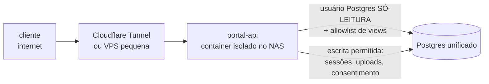

# Módulo Portal do Cliente — autoatendimento (Hamsa IPMI)

O único componente do sistema desenhado para ficar **exposto à internet**.
Última fase do roadmap de propósito: portal é vitrine — só faz sentido quando
cadastro, apólices, comissões e comunicação já estiverem consistentes por
dentro.

Artefatos: `README.md` (este desenho) + `schema.sql` (schema `portal`,
mínimo: identidade/sessão/auditoria). **Aplicar depois de `cadastro`.**

## 1. Escopo funcional (o que o cliente vê)

| Área | Conteúdo | Fonte |
|------|----------|-------|
| Minhas apólices | apólices ativas, dependentes, vigência, prêmio | `comissoes.apolice` + `cadastro.vinculo_apolice` |
| Documentos | 2ª via da apólice, cartões, proposta assinada | `propostas.documento` (tipos não sensíveis) |
| Renovação | aviso de renovação em andamento, novo prêmio | `renovacoes.ciclo_renovacao` |
| Sinistros/Reembolsos | **status apenas** (recebido → em análise → pago) + envio de documentos | Claims app (via API) |
| Meus dados | contatos, endereços, **consentimentos** (opt-in/out) | `cadastro` |

Fora de escopo por decisão: conteúdo clínico de sinistro (LGPD — o cliente
vê status e valores, não laudos), pagamento online (fase futura, se fizer
sentido), cotação self-service.

## 2. Arquitetura e threat model — a parte que importa

O sistema inteiro da Hamsa vive numa tailnet privada. O portal quebra essa
premissa, então o desenho é defensivo:

1. **Exposição via Cloudflare Tunnel** (ou VPS de borda): nenhuma porta
   aberta no roteador, NAS invisível, TLS e WAF de graça. A tailnet continua
   fechada.
2. **Container isolado** com **usuário de banco próprio** (`portal_ro`):
   `GRANT SELECT` apenas nas **views `portal.v_*`** — o portal não enxerga
   tabelas, schemas financeiros (comissões!) nem dados de outros clientes por
   construção: as views filtram por `pessoa_id` da sessão.
3. **Escrita mínima**: sessões/tokens, log de acesso, atualização de contato,
   consentimento (via função com `SECURITY DEFINER`), upload de documento de
   sinistro (arquivo vai para quarentena no storage, não para o banco).
4. **Autenticação sem senha**: magic link por e-mail ou OTP via WhatsApp
   (reusa o módulo Comunicação). Sem senha = sem vazamento de senha. Tokens
   de uso único com expiração curta; sessão de 30 dias revogável.
5. **Auditoria LGPD**: todo acesso a dado pessoal fica em `acesso_log`
   (quem, o quê, quando, de onde) — obrigação de accountability e insumo
   para responder titulares.
6. **Rate limiting** na borda (Cloudflare) + lockout progressivo de OTP.

## 3. Modelo de dados (mínimo de propósito)

O portal quase não tem dados próprios — ele é uma lente sobre os outros
módulos:

- **`usuario`** — `pessoa_id` + e-mail/telefone verificados, status;
- **`token_acesso`** — magic links e OTPs: hash do token (nunca o token),
  expiração, uso único;
- **`sessao`** — sessões ativas, revogáveis individualmente;
- **`acesso_log`** — trilha de auditoria (append-only);
- **views `v_minhas_apolices`, `v_meus_documentos`, …** — a allowlist do
  usuário `portal_ro`, sempre parametrizadas por pessoa.

## 4. Roadmap do módulo

| Fase | Entrega | Critério de pronto |
|------|---------|--------------------|
| 1 | Infra de borda (Tunnel) + auth magic link + "minhas apólices" (leitura) | cliente real logando e vendo suas apólices |
| 2 | Documentos (2ª via) + meus dados + consentimentos | opt-in/out do cliente refletindo em `cadastro.consentimento` |
| 3 | Status de sinistro + upload de documentos | reembolso acompanhado sem WhatsApp manual |
| 4 | Avisos de renovação no portal + pesquisa de satisfação | ciclo de renovação visível ao cliente |

## 5. Pré-requisitos duros (checklist antes da fase 1)

- [ ] Cadastro fase 2 concluída (`v_apolices_sem_cliente` = 0) — sem vínculo
      pessoa↔apólice não há "minhas apólices";
- [ ] Comunicação fase 1 (magic link chega por e-mail);
- [ ] Revisão de segurança do desenho de borda (Tunnel, headers, rate limit);
- [ ] Política de privacidade e termos publicados (LGPD).
