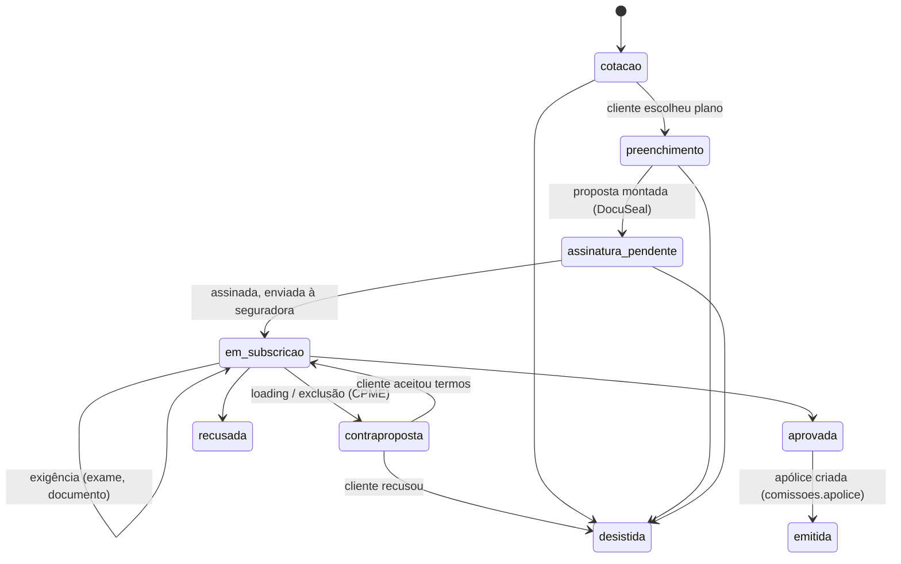

# Módulo de Propostas & Subscrição — esteira IPMI (Hamsa)

Fecha o buraco mais trabalhoso do funil: tudo que acontece entre **"cotei no
Multi Cálculo"** e **"apólice emitida no Multi Apólices"** — preenchimento da
proposta, declaração de saúde, assinatura (DocuSeal, já instalado no NAS),
idas e vindas do underwriting médico e a contraproposta.

Artefatos: `README.md` (este desenho) + `schema.sql` (schema `propostas`,
validado em Postgres 16). **Aplicar depois de `cadastro` e `comunicacao`.**

## 2. A esteira (máquina de estados)

Transições são registradas em `proposta_evento` (timeline auditável — quem,
quando, o quê). O estado atual fica em `proposta.status`; a história, nos
eventos. `dias_parada` na view de funil denuncia proposta esquecida.

## 3. Modelo de dados (resumo — DDL em `schema.sql`)

- **`proposta`** — cliente (`cadastro.cliente`), seguradora/produto
  (`comissoes.*`), referência da cotação no Multi Cálculo, prêmio cotado +
  moeda, data de início desejada, corretor, status. Quando emitida, aponta
  `apolice_id` (`comissoes.apolice`) — o elo que fecha o funil de ponta a
  ponta: cotação → proposta → apólice → comissão.
- **`proposta_pessoa`** — titular + dependentes da proposta
  (`cadastro.pessoa`), com flag de declaração de saúde exigida/recebida
  por pessoa.
- **`proposta_evento`** — timeline: mudanças de status e exigências do
  underwriting (`exigencia_exame`, `exigencia_documento`, `contraproposta`,
  `aprovacao`, `recusa`, `nota`), com prazo e resolução. As exigências em
  aberto são a fila de trabalho do dia.
- **`documento`** — arquivos da proposta: tipo (proposta assinada, DS,
  passaporte, comprovante de residência, W-8/FATCA, termos de contraproposta,
  apólice emitida), caminho no storage do NAS, `sha256`, e o trio DocuSeal
  (`submission_id`, status de assinatura, assinado em).
- **`modelo_documento`** — qual template DocuSeal usar por
  seguradora/produto/tipo (proposta da Cigna ≠ proposta da Bupa).
- **`requisito_produto`** — checklist configurável por produto: quais
  documentos são obrigatórios e condições (ex.: `idade > 64` exige exame;
  `pais_residencia <> 'BR'` exige W-8). A view `v_pendencias` cruza checklist
  × documentos recebidos.

## 4. Decisão LGPD central: a declaração de saúde NÃO vira dado estruturado

A DS contém dado sensível (saúde). Guardar as respostas em colunas/jsonb
criaria um passivo LGPD enorme para valor operacional quase nulo — a
corretora precisa saber **que** a DS existe, foi assinada e foi entregue à
seguradora, não **o que** o cliente respondeu.

Portanto: a DS é um **documento** (PDF assinado no DocuSeal), com hash, data
de assinatura e status de envio à seguradora. As respostas em si vivem só
dentro do PDF, com acesso restrito. O mesmo vale para laudos de exame. No
banco estruturado, saúde aparece no máximo como flag de exigência
(`exigencia_exame` pendente/resolvida), sem conteúdo clínico.

## 5. Integração DocuSeal (já roda no NAS, porta 3010)

1. Corretor monta a proposta no hub → módulo cria a *submission* via API do
   DocuSeal usando o `modelo_documento` da seguradora/produto, pré-preenchida
   com dados do `cadastro`.
2. Cliente recebe o link por **Comunicação** (template
   `proposta_assinatura`), assina no celular.
3. **Webhook** do DocuSeal (`form.completed`) → módulo baixa o PDF final,
   grava em `documento` (com sha256), marca assinado e avança o status da
   proposta para `em_subscricao` quando o checklist de assinaturas fecha.
4. Token da API do DocuSeal: variável de ambiente do serviço (nunca no banco).

## 6. Integrações com os demais módulos

| Com | O quê |
|-----|-------|
| Multi Cálculo | `cotacao_ref` liga a proposta à cotação de origem; reaproveita valores |
| Sales Pipeline | oportunidade ganha → cria proposta (fase 1: manual com referência; fase 2: automático) |
| Multi Apólices / `comissoes` | emissão preenche `apolice_id`; comissões passam a ter origem rastreável |
| Comunicação | assinatura pendente (D+2 lembrete), exigência ao cliente, aprovação |
| Cadastro | pessoas da proposta são `cadastro.pessoa` — dependente novo é cadastrado uma vez, não redigitado |

## 7. Views para o Command Center

- `v_funil` — propostas por status com `dias_parada` (SLA visual);
- `v_exigencias_abertas` — fila do dia: o que a seguradora pediu e está
  pendente, com prazo;
- `v_pendencias` — checklist × recebidos por proposta (o que falta coletar);
- `v_conversao` — por mês/seguradora: criadas × emitidas × recusadas ×
  desistidas e tempo médio até emissão.

## 8. Roadmap do módulo

| Fase | Entrega | Critério de pronto |
|------|---------|--------------------|
| 1 | Schema + tela de esteira no hub (status manual + timeline) | proposta real conduzida do início ao fim no sistema |
| 2 | DocuSeal: modelos, submission via API, webhook de assinatura | proposta assinada sem e-mail manual |
| 3 | Checklist por produto + exigências com prazo | `v_pendencias` e `v_exigencias_abertas` guiando o dia |
| 4 | Lembretes automáticos via Comunicação + conversão no hub | D+2 de assinatura pendente dispara sozinho |
