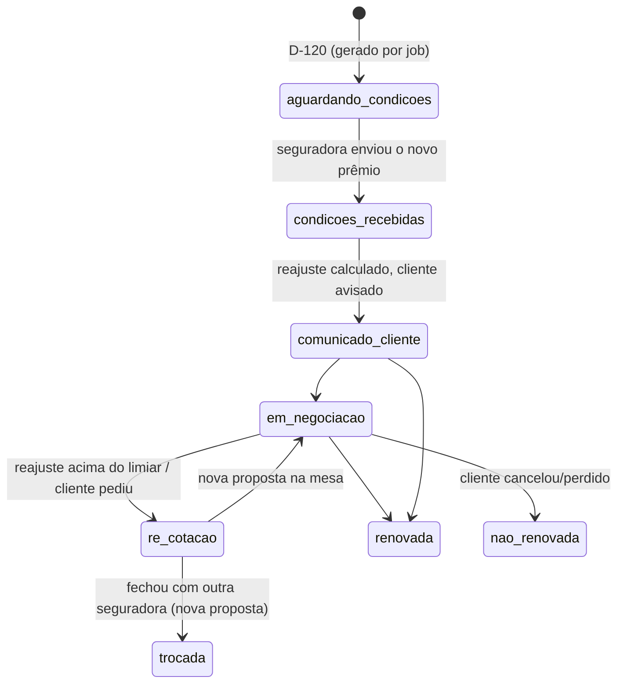

# Módulo de Renovações 2.0 — inteligência de reajuste (Hamsa IPMI)

Evolução do app de Renovações atual: de lista de tarefas para **motor de
retenção**. IPMI reajusta todo ano (faixa etária + inflação médica + câmbio);
este módulo calcula o reajuste, cria a régua de contato automaticamente e
aponta quando vale **re-cotar** (re-broking) em vez de só renovar.

Artefatos: `README.md` (este desenho) + `schema.sql` (schema `renovacoes`,
validado em Postgres 16). **Aplicar depois de `comissoes` e `comunicacao`.**

## 1. Conceito central: o ciclo de renovação

Cada apólice ativa gera, **automaticamente em D-120** do aniversário, um
`ciclo_renovacao` — o dossiê daquela renovação:

O ciclo carrega prêmio atual × prêmio de renovação e o **% de reajuste**
(coluna gerada — nunca calculado errado à mão), decomposto quando a
seguradora informa (faixa etária vs. inflação médica).

## 2. As três automações que pagam o módulo

1. **Geração de ciclos** — `gerar_ciclos()` (job diário): apólice ativa com
   aniversário nos próximos 120 dias e sem ciclo aberto → ciclo criado.
   Nenhuma renovação esquecida, que é a forma mais cara de perder cliente.
2. **Régua de contato** — ao criar o ciclo, `gerar_cadencia()` agenda as
   tarefas dos marcos configuráveis (`cadencia_config`: D-90, D-60, D-30,
   D-7, D+3), cada um opcionalmente ligado a um template do módulo
   **Comunicação** (disparo automático) ou a uma tarefa manual (ligação).
   Renovou antes? `encerrar_cadencia()` cancela o resto da régua.
3. **Gatilho de re-cotação** — parâmetro `reajuste_alerta_pct` (padrão 15%):
   ciclos acima do limiar aparecem em `v_recotacao_recomendada`, com link
   para cotar de novo no Multi Cálculo. É a defesa do cliente — e o argumento
   de retenção da corretora.

## 3. Modelo de dados (resumo — DDL em `schema.sql`)

- **`ciclo_renovacao`** — apólice, aniversário, prêmios (atual/renovação,
  na moeda da apólice), `pct_reajuste` gerado, decomposição opcional
  (`pct_faixa_etaria`, `pct_inflacao_medica`), status, decisão final
  (`renovar/re_broking/cancelar`) e resultado. Um ciclo por
  apólice+aniversário (unicidade).
- **`tarefa_cadencia`** — a régua: marco (`D-90`…`D+3`), data-alvo
  calculada, canal, template de comunicação (se automático), `feito_em` /
  `cancelada_em`, e a referência da mensagem enviada (auditoria de que o
  cliente foi mesmo avisado).
- **`cadencia_config`** — os marcos são configuração, não código: dias antes
  do aniversário, automático ou manual, template. Mudar a régua = UPDATE.
- **`parametro`** — chave/valor do módulo (limiar de alerta, dias de
  antecedência da geração).

## 4. Relação com o app Renovações atual

O app v1 continua operando durante a transição; o módulo nasce no banco
unificado e o hub passa a mostrar a visão nova. Migração: importar as
renovações em andamento como ciclos (`status` mapeado), depois apontar o app
v1 para leitura das views ou aposentá-lo. Nenhum big-bang: os dois podem
coexistir por um ciclo anual inteiro.

## 5. Integrações

| Com | O quê |
|-----|-------|
| `comissoes.apolice` | fonte dos ciclos; renovação confirmada atualiza `premio_anual` da apólice e dispara `comissoes.gerar_parcelas()` do novo ano (taxa de renovação) |
| Comunicação | marcos automáticos enfileiram template com variáveis (prêmio novo, % reajuste, data) |
| Multi Cálculo | `re_cotacao` guarda a referência da nova cotação |
| Propostas | re-broking que fecha vira proposta nova (`trocada` aponta a proposta) |

## 6. Views para o Command Center

- `v_pipeline` — ciclos dos próximos 120 dias por status, com dias até o
  aniversário e valor em risco (prêmio anual);
- `v_cadencia_hoje` — tarefas do dia (manuais a fazer + automáticas com falha);
- `v_recotacao_recomendada` — reajustes acima do limiar ainda não resolvidos;
- `v_retencao` — por mês: renovadas × não renovadas × trocadas, taxa de
  retenção e reajuste médio aceito.

## 7. Roadmap do módulo

| Fase | Entrega | Critério de pronto |
|------|---------|--------------------|
| 1 | Schema + geração de ciclos + tela no hub | ciclos D-120 criados para 100% das apólices ativas |
| 2 | Régua de cadência com disparo via Comunicação | D-30 automático chegando no cliente |
| 3 | Registro de condições + gatilho de re-cotação | `v_recotacao_recomendada` em uso no dia a dia |
| 4 | Fechamento do ciclo integrado a comissões | renovação confirmada gera parcelas do novo ano sozinha |
| 5 | Migração/aposentadoria do app v1 | operação 100% no módulo novo |
